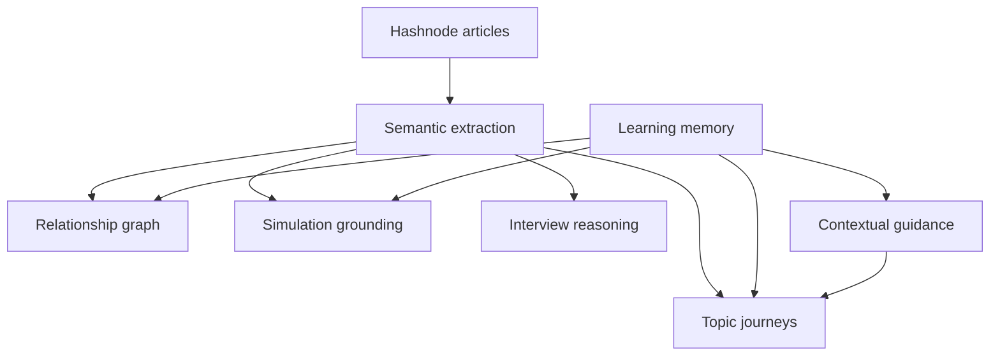

# Engineering Cognition Platform Evolution

This is the north-star architecture for Abstract Algorithms. It keeps Hashnode articles, MDX, GraphQL, SEO, and editorial ownership intact while moving the user experience from content consumption to engineering reasoning.

## Product Architecture

Articles remain the canonical source of truth. Topic journeys become the learner-facing unit. The graph, simulations, guidance, and search are composed from article metadata and progressively enhanced client components.

## UX Architecture

- Navigation stays: Learn, Practice, AI Mentor, Discover.
- Learn starts with topics, then articles and series underneath.
- Article pages act as cognition surfaces, not endpoints.
- Simulations appear inline where the concept needs operational intuition.
- Interview reasoning appears as a natural engineering prompt, not a separate coaching widget.
- Mobile uses the sequence: Concept, Visual, Tradeoff, Challenge, Continue.

## Cognition Engine

The engine has four responsibilities:

1. Extract concepts, dependencies, tradeoffs, failures, and implementation references from canonical articles.
2. Compose topic-level journeys from many articles.
3. Adapt the next step using learning memory.
4. Ground AI guidance in article-backed context and optional semantic retrieval.

## Topology System

Topology is the operating surface for understanding:

- Nodes represent concepts, system components, constraints, or failure states.
- Edges represent prerequisite, dependency, extension, tradeoff, or adjacency.
- Article pages use local topology.
- Discover uses global topology.
- Topic pages use scoped topology across the article set.

## Simulation Framework

Simulations should feel like observing real systems behavior:

- Start from article or topic context.
- Use quiet controls: replay, step, pressure test, slow down.
- Track failed attempts and tradeoff mistakes in learning memory.
- Lazy-load heavier primitives where possible.
- Keep visuals professional and legible rather than game-like.

## AI Mentor Architecture

AI is a contextual guide, not a standalone product:

- It receives page context, section context, current concept, topic state, and learning memory.
- It suggests next concepts, pressure tests, and reasoning prompts.
- It should appear as guidance, not as a dominant chat surface.
- It must never replace canonical article authority.

## Adaptive Learning System

Memory tracks:

- explored concepts
- completed concepts
- revisits
- weak areas
- simulation failures
- tradeoff mistakes
- interview readiness
- preferred depth and domains

Adaptation happens quietly through recommendations, topic ordering, inline prompts, and simulation suggestions.

## Article Rendering

Keep article routes canonical and indexable. Render the authored MDX body as expandable deep reference. Above it, compose:

1. TLDR
2. topology
3. mental model
4. production reasoning
5. pressure testing
6. exploration
7. reasoning prompts
8. related systems
9. topic continuation

## Component Architecture

- `lib/topic-learning.ts`: topic composition.
- `lib/concept-graph.ts`: relationship model.
- `lib/learning-memory.ts`: persisted learner state.
- `lib/semantic-search.ts`: local and optional `llm-wiki` retrieval.
- `components/topic-learning-journey.tsx`: topic cognition surface.
- `components/systems-knowledge-graph.tsx`: relationship navigation.
- `components/visualization/*`: simulation primitives.
- `components/embedded-ai-mentor.tsx`: contextual guidance.

## Performance Strategy

- Keep canonical article rendering server-first through existing pages.
- Avoid loading simulation-heavy code until needed.
- Keep topic aggregation deterministic from GraphQL post data.
- Use ISR for topic pages.
- Persist learning memory locally with lightweight Zustand storage.
- Use semantic search only on user intent.

## Progressive Migration Plan

1. Keep Pages Router stable while the Hashnode Starter Kit remains Pages-based.
2. Add topic journeys as progressive routes.
3. Move high-intent CTAs from articles to topic journeys.
4. Gradually extract article semantics into durable metadata.
5. Add optional `llm-wiki` retrieval behind `LLM_WIKI_SEARCH_URL`.
6. Migrate to App Router only when it does not risk SEO, MDX rendering, or GraphQL publishing.
