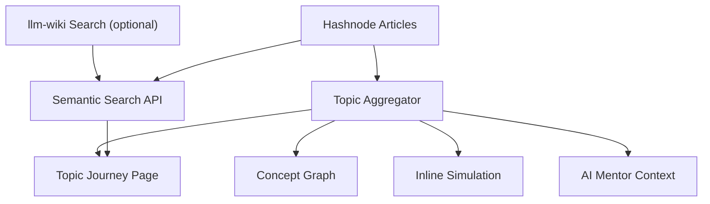

# Topic Learning Architecture

Abstract Algorithms now treats a topic as the learner-facing unit. Articles remain the canonical Hashnode knowledge objects for SEO, authorship, MDX, and GraphQL publishing, but the product experience can compose many articles into one adaptive topic journey.

## Model

- `Article`: canonical authored source, preserved at `/<slug>`.
- `Topic Journey`: multi-article cognition surface at `/topic/<slug>`.
- `Learning Graph`: dependency navigation and prerequisite map.
- `llm-wiki semantic retrieval`: optional enrichment layer for finding related explanations without replacing canonical articles.

## Runtime Flow

## Implementation

- `lib/topic-learning.ts`: builds topic journeys from existing GraphQL post data.
- `pages/topic/[slug].tsx`: renders the topic learning route.
- `components/topic-learning-journey.tsx`: composes stages, article sequence, graph, simulation, mentor, and semantic search.
- `pages/api/semantic-search.ts`: merges local Hashnode article retrieval with optional `llm-wiki`.
- `lib/semantic-search.ts`: local token scoring and `llm-wiki` adapter.

## llm-wiki

Set `LLM_WIKI_SEARCH_URL` to enable external semantic search. If `LLM_WIKI_API_KEY` is present, the API sends it as a bearer token. Without these values, topic search still works against canonical Hashnode articles.

## UX Rule

Users should not feel they are learning one article at a time. Article pages now point toward the broader topic journey, while article routes remain canonical and indexable.
